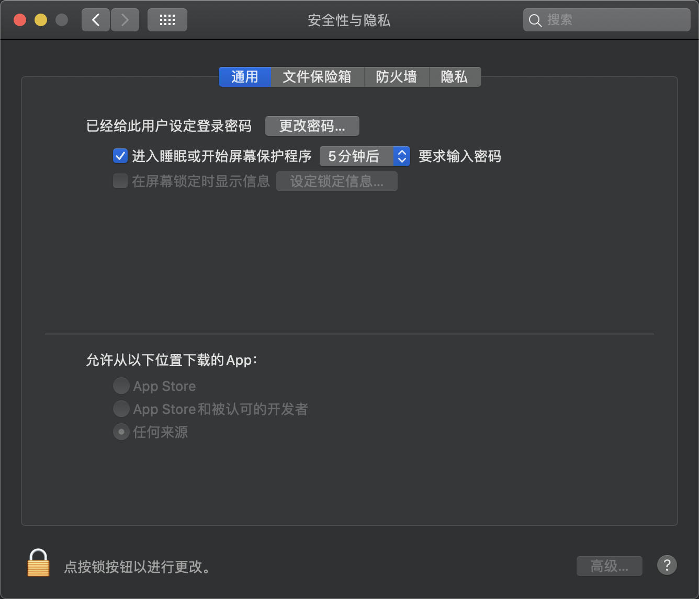

[toc]

# 无法打开app

## 安装失败/打不开dmg

`mac OS` 上解禁 `任何来源的`  让`app` 的`dmg`安装包可以打开并下载



需要输入以下命令：

```bash
sudo spctl --master-disabl
```

## 安装后显示app损坏无法打开的

请输入以下命令后重启`app`

```bash
sudo xattr -d com.apple.quarantine <app所在路径>
```

