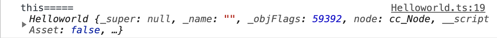
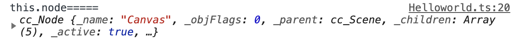

[toc]


# 前端快速入门cocos开发

## 前言

​	本篇有两部分内容，一部分是cocos开发，另一部分是web应用于游戏开发的区别。前者这部分适合想要学习cocos开发游戏的同学来看，后者这部分适合有过 vue/react 现代前端框架开发经验同学来看。

## cocos开发小游戏的优势

​	Cocos Creator 目前支持发布游戏到 Web、iOS、Android、各类"小游戏"、PC 客户端等平台，**真正实现一次开发，全平台运行**。

关于cocos介绍：https://docs.cocos.com/creator/manual/zh/getting-started/introduction.html

## cocos的一些基础

cocos游戏开发有些东西和web端开发非常类似的概念：

| web                          | cocos                        |
| ---------------------------- | ---------------------------- |
| 页面                         | 场景                         |
| dom节点                      | 组件节点（prefab）、层级节点 |
| 多媒体（图片、视频、音频等） | 与web相同                    |
| Js脚本                       | js脚本                       |

以及一些对应用的类似处理

|          | cocos                                                        | web                                              |
| -------- | ------------------------------------------------------------ | ------------------------------------------------ |
| 界面描述 | 需要定制的编辑器来实现 cocos 编辑器是用来描述界面，定义有哪些内容，初始的内容层级、状态等等是怎样的。 | html+css来完成，在文本编辑器中就可以实现         |
| 脚本能力 | 逻辑开发会在脚本文件中描述，整体开发是需要分开两个编辑区域来完成。 | 可以控制全局逻辑，通过dom开放的API来实现一些能力 |

快速上手cocos开发呢，官方给出的例子非常棒 [helloword传送门](https://docs.cocos.com/creator/manual/zh/getting-started/hello-world.html) 、[稍稍复杂一点的游戏demo传送门](https://docs.cocos.com/creator/manual/zh/getting-started/quick-start.html) 那么我想来介绍的东西主要是一些在开发过程中遇到的小问题。

## cocos的那些绊脚石

### 组件概念的区别

在cc中组件有两中，一种是编辑的视图，另一种是视图对应的脚本。前者对游戏设计者来说是组件，对脚本开发的同学来说只是一种未单独提取出来得prefab。后者对开发同学来说才是真正意义上的程序组件。所以cc有两套节点树，一套是视图编辑中的prefab，一套是组件上挂载的脚本的。通过 this.getComponets 获取的组件是第二种。第一种的话直接通过获取层级（prefab）节点可以拿到。

### 获取层级节点（prefab）

​	我们来解释获取层级节点或者说是单独抽离出去的prefab怎么获取。

​	这部分是cc编辑器左上角所展示的层级树，层级节点指的就是这个。

-20201228020001003.(null))

那我们在脚本中可以直接使用 this.node 获取到最外层的名字叫 Canvas 的节点，然后获取子节点呢？我们可以通过访问 this.node.children

```js
// 获取到cocos节点
this.node.children.filter((item) => item.name === "cocos")[0];
```

你说我们去找他子节点太麻烦了，怎么办？那我们有另一种方法，通过cc提供的方式进行挂载。首先要在脚本中创建一条属性（见图2），并在@property中指明对应的节点类型，然后再把cocos这个节点拖拽到这个属性上（见图一），然后就可以在代码中通过 `this.cocos` 来访问这个节点了。

-20201228015934981.(null))

图一

-20201228020025646.(null))

图二

### 操作层级节点（绑定事件）

​	节点获取到之后，那么我们绑定事件如何操作呢？绑定事件的写法类似于jquery的风格，有那么一瞬间我感觉回到了jq的时代。

-20201228020204580.(null))

​	这里注意！！！绑定事件的节点是prefab这种UI界面上绘制定义的层级节点~ 。如果想在脚本组件之间传递信息、自定义事件这些事，我们就不能这样去绑定事件了。我们需要借鉴vue/react这种现代框架的实现组件间的通信~

### 修改组件属性

​	直接找到对应节点修改即可。

值得注意的一点是cocos的组件内 this指代当前的代码组件：



this.node 才是prefab的层级节点内容：




## 相关资源

- 代码地址 https://github.com/wsz7777/cocos

- Cocos官网 https://www.cocos.com/docs

- Cocos文档 https://docs.cocos.com/creator/manual/zh/getting-started/

- cocos原生开发的21点小游戏（腾讯出品） https://github.com/cocos-creator/tutorial-blackjack