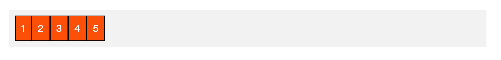
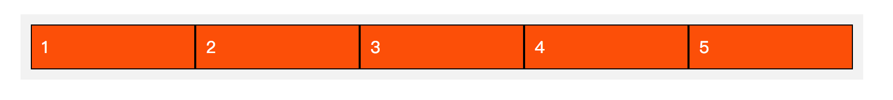
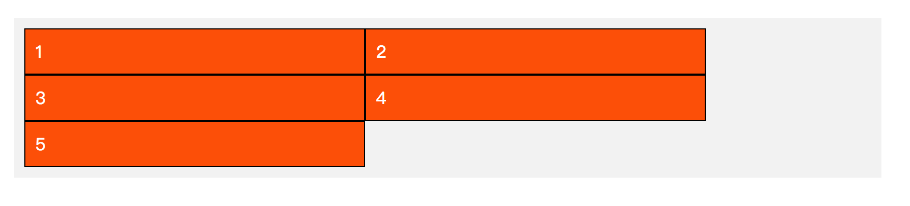

[TOC]

# flexbox 入门

​	众所周知，`flexbox` 是一种新的 `css` 布局方式，这部分既然是入门，那我们再看一下日常需求中的几种布局在 `flexbox` 的状态下是如何解决的。不过在解决之前还是要了解几个基本概念。

##flexbox基本概念

1. 在 `flexbox` 的布局中，分为 **容器** 与 **子项** 这两个部分；
2. 布局方式在 `flexbox` 之前有 **不脱离文档流** 、 **半脱离文档流**以及 **脱离文档流** 三种；
3. `flexbox` 属于 **不脱离文档流** 布局方式；
4. 关于 `flexbox` 的 `css` 属性分为两类： **容器** 与 **子项** ，**容器** 部分的设定是在设定 **子项** 的基础排列方式和顺序，**子项** 部分的设定是针对个体自定义的排列方式。

## flexbox应对常用布局

​	声明一个公共样式部分：

```css
 /* 色彩样式部分 */
* {
    margin: 0;
    padding: 0;
}

.parent {
    width: 800px;
    padding: 10px;
    background-color: #f5f5f5;
    margin: 20px auto;
}

.child {
    background-color: #000;
    color: #fff;
    padding: 10px;
    margin: 10px;
}
```

​	声明所布局的 `html` 代码

```html
<div class="parent">
    <div class="child">1</div>
    <div class="child">2</div>
    <div class="child">3</div>
    <div class="child">4</div>
    <div class="child">5</div>
</div>
```

### 列表横向排布——单排

代码：

```css
.parent {
	display: flex;
	justify-content: flex-start; // flex-start是默认值
}
```

效果图：



这个子项宽度是根据内容撑开大小确定的，所以想要使子项宽度均匀的分布在这里的话需要增加一行设定：

```css
.child {
    flex: 1;
}
```

效果如下：


### 列表横向排布——多排

代码：

```css
.parent {
    display: flex;
    justify-content: flex-start;
    flex-wrap: wrap;
}

.child {
    width: 300px;
}
```

效果如下：


