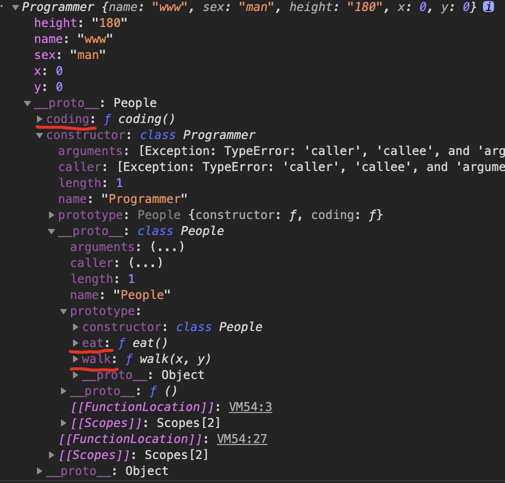

[toc]

# class相关

## 基础概念

- 类
- 继承
- 实例化

### 类——class

​	类的定义只是对事物的基础描述。例如 `人（People）` 这个类，有姓名、性别、身高体重等等这些属性，还有行走、吃饭等这些动作。

​	由上述条件我们定义如下一个 `People` 类

```js
class People {
	name = 'wsz'
	sex = 'man'
	height = '170'
	x = 300
  y = 500

	walk(x,y) {
  	this.x += x;
    this.y += y;
    return {
    	x : this.x,
      y : this.y
	  }
  }

	eat() {
		console.log('正在吃东西')
  }
}
```

### 继承——extends

​	我们身处社会之中，有各种各样的职业，每个职业呢都有自己的特长。例如说 `程序员 有编码（coding）这种特殊能力，但是程序员也会有姓名、性别、身高体重等等这些属性，还有行走、吃饭等这些动作，我们如果重新对 `程序员` 这个类去定义这些东西增加代码量不说，而且也没有必要重复定义相关内容，这时候我们怎么办呢？只要声明它继承于`People`这个类就行了

```js
class Programmer extends People {
  coding(){
		console.log('编写代码')
  }
}
```

### 实例化——new

​	我们前面对某个概念（`People` 和 `Programmer`）进行了定义，但他始终只是一个定义，而且 `People` 和 `People` 的数据是不一样的，所以我们需要对这个概念进行实例化，也就是 `new People()`。我们上述的两段代码并不能实现实例化后的数据差异，还需要一点小小的改动：

```js
// People 类定义 
class People {
  constructor(param) {
    this.name = param.name;
    this.sex = param.sex;
    this.height = param.height;
    this.x = param.x;
    this.y = param.y;
  }

  walk(x, y) {
    this.x += x;
    this.y += y;
    return {
      x: this.x,
      y: this.y
    };
  }

  eat() {
    console.log("正在吃东西", this);
  }
}

// Programmer 类定义
class Programmer extends People {
  constructor(param) {
    super(param);
  }

  coding() {
    console.log("编写代码");
  }
}
```

实例化方式是通过`new`

```js
new People({
  name: "wsz",
  sex: "man",
  height: "170",
  x: 300,
  y: 500
});

// or
new Programmer({
  name: "www",
  sex: "man",
  height: "180",
  x: 0,
  y: 0
});
```



## this

这里提到`this`是因为我们在实现以上代码时是用`es6`的语法来实现的，我们在`es6`之前的代码中要实现的写法如下

`People`实现：

```js
function People(param) {
  	param = param || {}
    this.name = param.name;
    this.sex = param.sex;
    this.height = param.height;
    this.x = param.x;
    this.y = param.y;
  	return this
}

People.prototype.walk = function(x, y) {
  this.x += x;
  this.y += y;
  return {
    x: this.x,
    y: this.y
  };
}

People.prototype.eat = function() {
  console.log("正在吃东西", this);
}
```

`Programmer`实现：

```js
function Programmer(param) {
  People.call(this, param)
}

// 定义原型链 继承谁
Programmer.prototype = new People()
// 再重新定义构造函数，确保this的指向正确
Programmer.prototype.constructor = Programmer

Programmer.prototype.coding = function() {
  console.log("编写代码");
}
```

