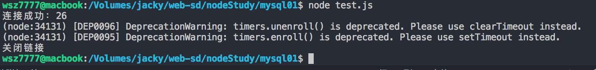
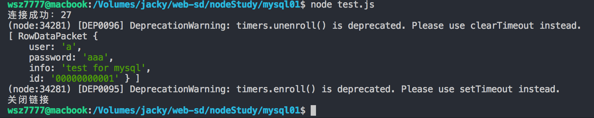

[TOC]

# 在Node中使用MySQL

​	在一个web服务中，必然会使用一种数据库，数据库的作用不在此赘述，先来说说在Node中使用MySQL的方法吧。

## 安装MySQL

### mac 安装

```bash
$ brew install mysql
# 安装完成之后 要手动开启mysql服务
$ mysql.server start
# 配置密码 初始root为空密码
$ mysql_secure_installation
# 剩下的步骤按照提示来就好了
```

### CentOS安装

​	CentOS上安装mysql时，yum默认安装的mysql是mariadb。

```bash
$ 
```

### UbuntuServer安装

```bash
$ sudo apt-get install mysql-server
$ sudo apt-get isntall mysql-client
$ sudo apt-get install libmysqlclient-dev
# 使用下面的命令检查一下mysql是否启动
$ sudo netstat -tap | grep mysql
```

### 安装完成后

```bash
$ mysql -u <user-name> -p <user-passwd>
# 通过此命令登录数据库
```


## 连接MySQL

### 环境

​	在Node上使用MySQL需要一个NPM的包（包名为mysql）。所以我们使用NPM命令装在项目内。

```bash
$ npm install mysql
```

### 连接

​	连接时我们需要一些必要的条件如用户名、密码、数据库地址/端口、数据库名等等。在js中配置这个非常简单，看下方代码块：

```javascript
// test.js
'use strict';
const mysql = require('mysql');
// 配置
const db = mysql.createConnection({
    host: '主机IP地址',
    user: '用户名',
    password: '密码',
    database: '数据库名'
});
// 连接
db.connect((err) => {
    if (err) {
        console.log('连接失败：' + err.stack);
    }
    console.log('连接成功：' + db.threadId);
});
// 关闭连接
db.end((err) => {
    if (err) {
        console.log(err);
    }
    console.log('关闭链接');
});
```

然后在终端cd至这个目录下执行此脚本文件

```bash
# $ cd <test.js 的路径>
$ cd /Volumes/jacky/web-sd/nodeStudy/mysql01
$ node test.js
```



## 简单使用

​	这里先举个简单的例子，展示一下，后面我们在搞封装便于应用在工程项目中。

```javascript
// test.js
'use strict';
const mysql = require('mysql');
const db = mysql.createConnection({
    host: '主机IP地址',//本地数据库这里可以使用localhost也可以使用127.0.0.1
    user: '用户名',
    password: '密码',
    database: '数据库名'
});

db.connect((err) => {
    if (err) {
        console.log('连接失败：' + err.stack);
    }
    console.log('连接成功：' + db.threadId);
});

// 在 user_info表中 查询 id值为1 的数据：
db.query('SELECT * FROM user_info WHERE id = "1"', (err, results, fields) => {
    if (err) {
        console.log(err);
    }
    console.log(results);
});

db.end((err) => {
    if (err) {
        console.log(err);
    }
    console.log('关闭链接');
});
```

控制台输出结果如下图：



