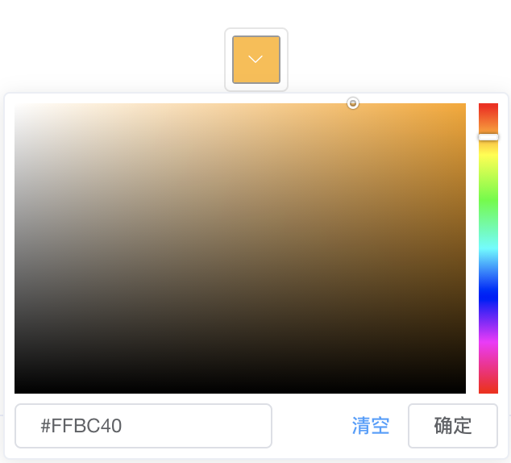
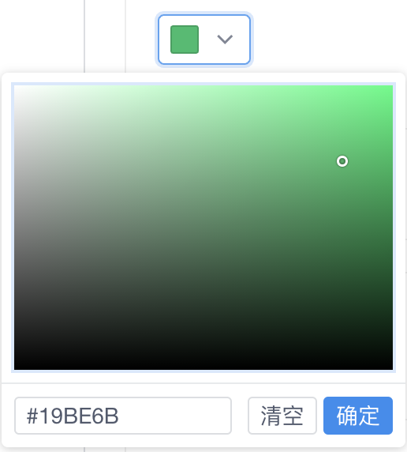
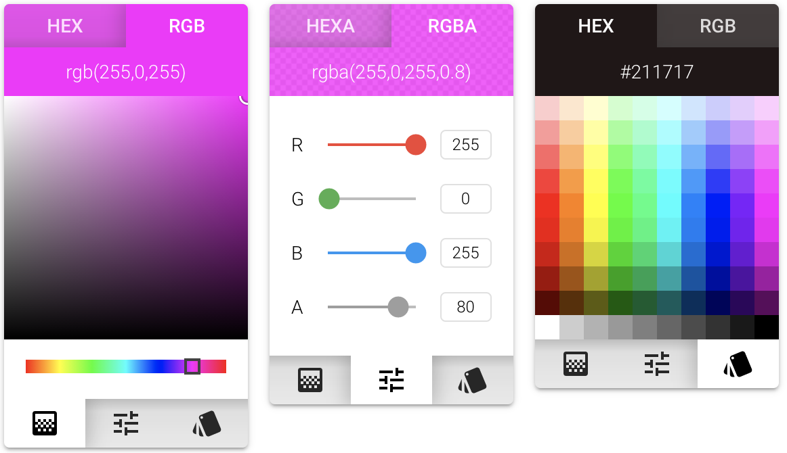
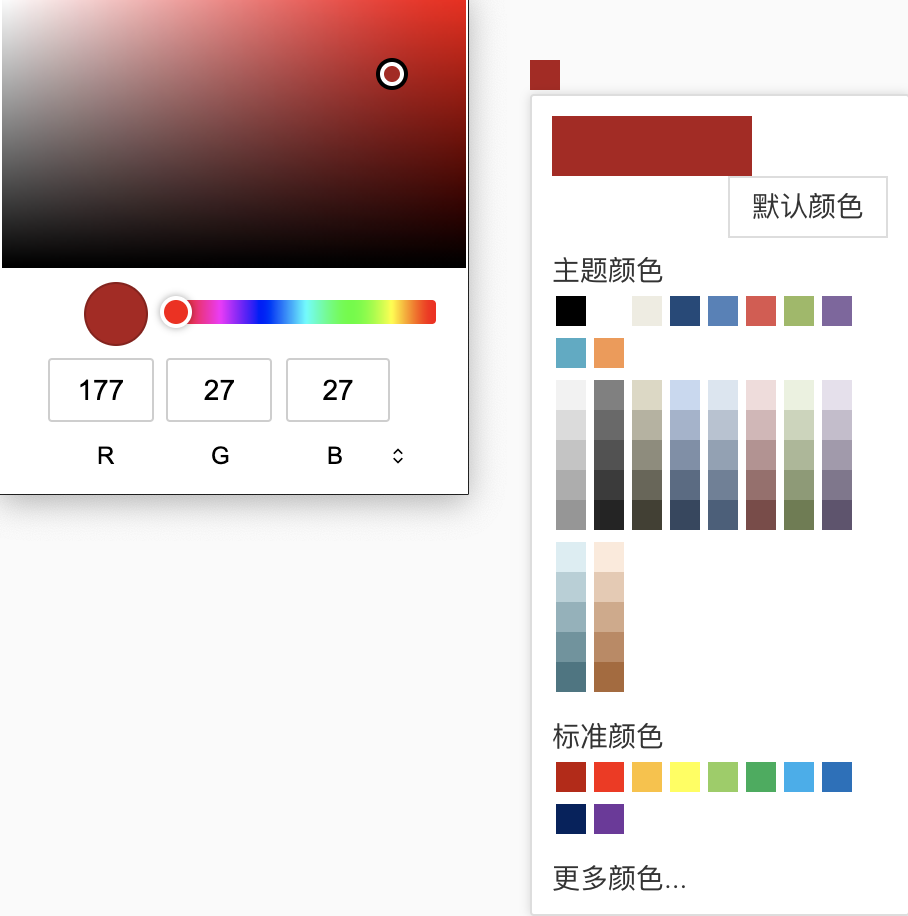
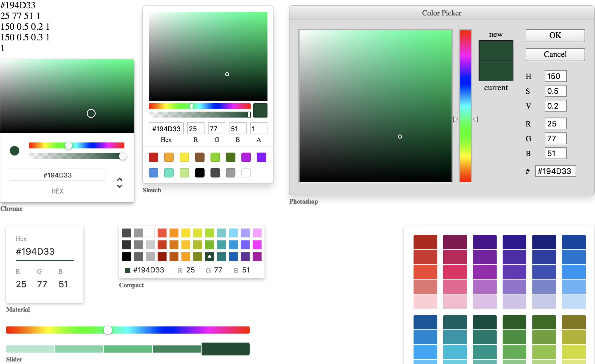

[toc]

# Color-picker

## 调研

### 市面上有的各类颜色选择器

> `ant-desgin-vue`居然没有颜色选择器。。。差评

- [element-ui：color-picker](https://element.eleme.cn/#/zh-CN/component/color-picker) `element-ui` 的颜色选择器，vue的ui组件库里的老大哥，稳定性肯定没的说

  

- [iview：color-picker](https://www.iviewui.com/components/color-picker) 新晋ui

  

- [quasar：color-picker](http://www.quasarchs.com/vue-components/color-picker)  真的很好看，设计风格很现代

  

- [vue-color-picker](https://github.com/zuley/vue-color-picker) 参考`angular`里的颜色选择器实现的组件库

  

- [vue-color](https://github.com/xiaokaike/vue-color) 有点小牛B，各种款式的选择器都搞出来了

  
  
  

### 查看实现

发现一个用于颜色转换的小工具 [TinyColor](https://github.com/bgrins/TinyColor) 可以进行颜色类型之间的转换。

颜色类型有 

- 单词（white、red）
- 字符串（#fff、#838383）
- rgb类型（rgb(0,0,0)、rgba (255, 0, 0, .5)）
- hsv类型（hsv(0, 100%, 100%)、hsva(0, 100%, 100%, .5)）
- hsl类型（hsl(0, 100%, 50%)、hsla(0, 100%, 50%, .5)）

表示方式还是很多的，之间进行转换还是要耗费不少精力来完成，现在有 `TinyColor` 可以帮助我们完成各种类型的转换

## 封装

### 思路

​	一个完整的颜色选择器是由 展示（选择）色块、调色盘 两部分组成。其中 `element-ui`、`iview`、`vue-color-picker` 都封装了完整的颜色选择器。而 `vue-color`、`quasar` 只是提供了调色盘。


### 代码

```tsx
import { Vue, Component, Watch, Model } from "vue-property-decorator";
import { Sketch } from "vue-color";
Vue.component("sketch-color-picker", Sketch);
import { Icon, Popover } from "ant-design-vue";
Vue.use(Icon).use(Popover);

import S from "./ColorPicker.module.scss";

/**
 * @use 暂时使用 `Vue.component(xxx.name, xxx)` 的方式加载
 * ```js
 * import { ColorPicker } from "@/components/config/ColorPicker";
 * Vue.component(ColorPicker.name, ColorPicker);
 * 
 * <color-picker v-model={this.color} />
 * ```
 */
@Component
export class ColorPicker extends Vue {
  name = "color-picker";

  /** v-model 支持 */
  @Model("input")
  value!: string;
  /** 当前组件内color的响应式数据 */
  color = "";
  /** 控制弹出层展示 */
  show = false;

  @Watch("value", { immediate: true })
  watchValue(val: string) {
    // console.log(val);
    this.color = val;
  }

  renderContent(props: any) {
    console.log(props);
    // start 此处可以进行各类调色版的替换哦 
    return (
      <sketch-color-picker
        class={S.pick}
        value={this.color}
        on-input={(color: any) => {
          // this.color = color.hex8;
          // console.log("color", color.hex8);
          this.$emit("input", color.hex8);
        }}
      />
    );
    // end 
  }

  render() {
    const { renderContent: content } = this;
    return (
      <a-popover
        class={S.colorPicker}
        v-model={this.show}
        trigger="click"
        overlayClassName={S.popoverFloat}
        scopedSlots={{ content }}
      >
        <a-button class={S.selectBtn}>
          <div class={S.displayColor}>
            <div style={{ backgroundColor: this.color }} />
          </div>
          <a-icon type="edit" class={S.icon} />
        </a-button>
      </a-popover>
    );
  }
}
```

