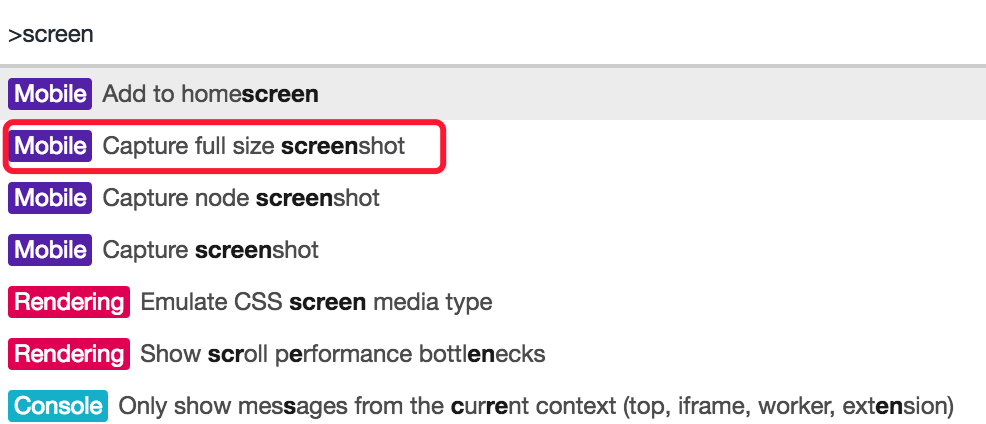
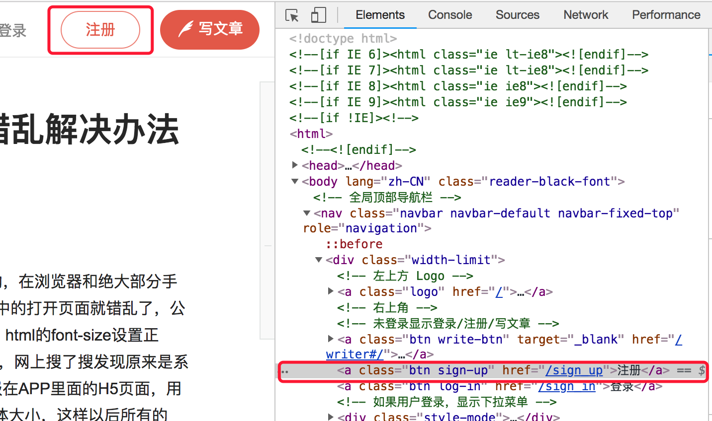
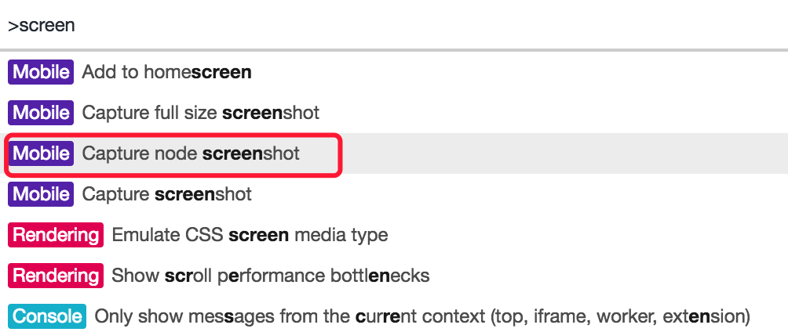
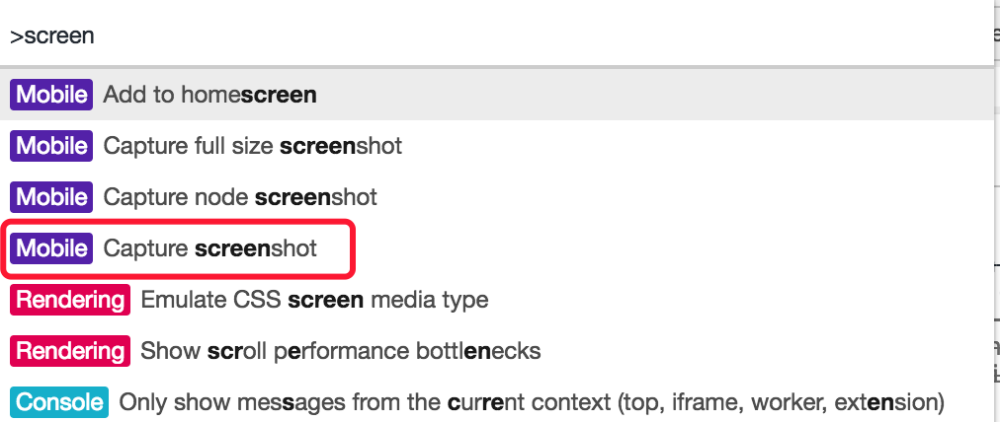

[TOC]

# 截图功能

​	在前端开发工作中，我们时常会需要截取整个页面，但是很多工具不好用，`mac` 上 `Chrome` 的插件有的也是时灵时不灵。在此提供一种 `Chrome` 开发者工具提供的方法

## 截取整个页面

> 打开页面
> alt+cmd+i 打开开发者工具
> cmd+shift+p 打开开发者命令调用
> 输入screen
> 选择下图标红处
> 
> 最后在下载中找到刚刚下好的截图就ok啦

截图效果如下：

## 截取某个dom节点的截图

> 开始前两步相同，在打开命令截图之前请在 `Elements` 中点击一下你要选中的元素，如下：
> 
> 注：红色标注部分左边的是选择的元素图像，右边的是选中的节点。
> 还是cmd+shift+p打开命令工具
> 这次选择：
> 

截图效果如下：

## 一般截图

> 选择：
> 

效果图：
