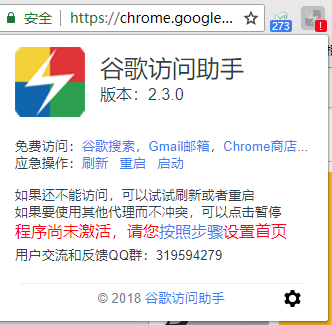
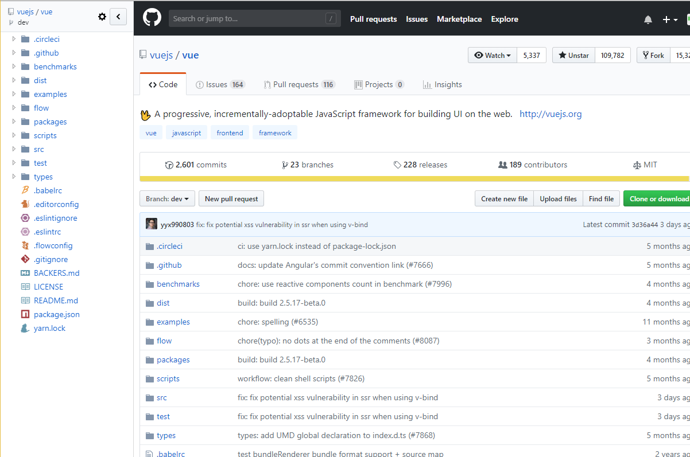
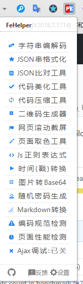
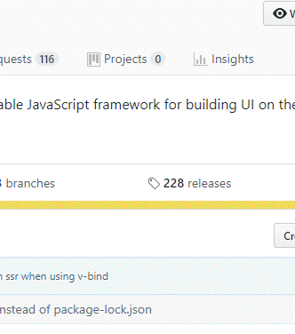
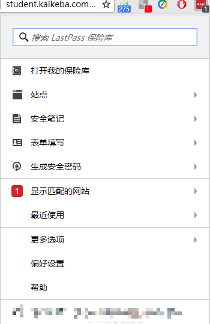
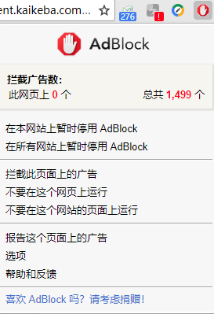
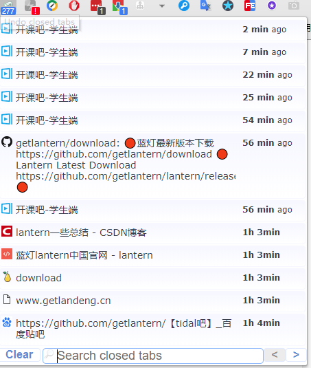
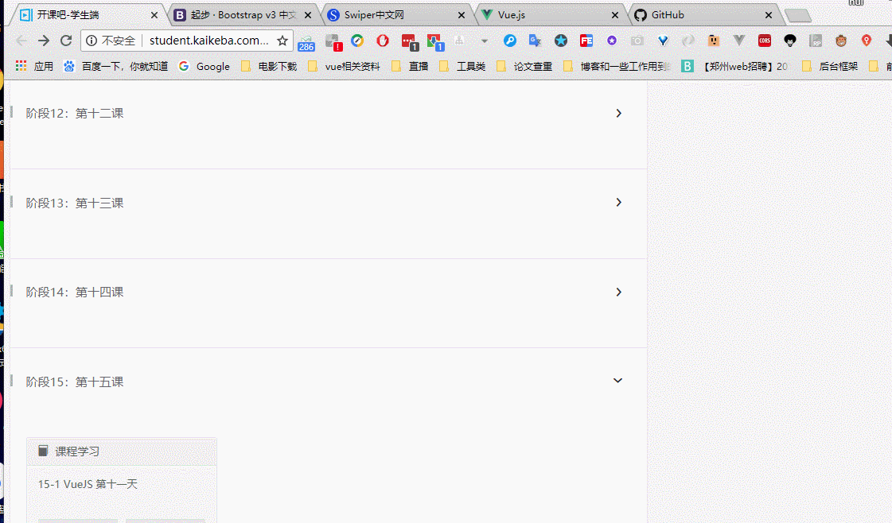
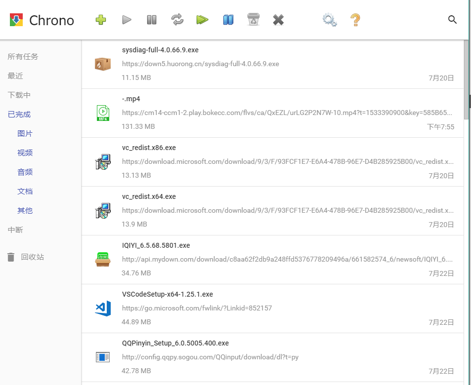

[TOC]

**身为开发人员不会访问谷歌搜索???不好意思哦，我们不是朋友~ 滑稽.jqg**

​	因为谷歌浏览器现在不支持第三方安装扩展了，所以目前的方式是通过安装一个翻墙工具后，在下载扩展插件，在[github蓝灯地址上](https://github.com/getlantern/download)可以下载纯净蓝灯翻墙工具，直接下载后双击运行就可以翻墙，不过一般要等一段时间~

# 访问谷歌商店

## 谷歌访问助手	

[谷歌商店地址](https://chrome.google.com/webstore/category/extensions?utm_source=chrome-ntp-icon)

访问谷歌搜索先下载稳定的扩展插件 **谷歌访问助手**

​	这个插件如图所示 可以访问谷歌搜索，谷歌邮箱，谷歌商店，但是并不是所有网站都能访问（比方说facebook,youtobe这些还是被限制的，平常搜索东西足够用了）

​	打个小广告，我朋友自己搭的vps（比vpn要快和稳定），翻墙很稳定，国外一切网站无障碍浏览，自己用了很长时间，受益无穷，推荐给想使用的朋友，但是需要付国外的服务器费用，所以不得以采用收费模式，支持mac,windows,安卓端，iso端，无障碍翻墙，目前只按月出售，不提供试用，可以观看翻墙后的视频，定价是1元一天，想使用的朋友请联系微信号

## Octotree

先上截图

这个插件主要作用是当使用github时，右侧会自动生成菜单栏，贼方便哦~

## WEB前端助手

上截图

这是它的功能，心动.jpg~

## google翻译

最便捷的功能，鼠标选中不懂得英文，右下角会出现google翻译的图标，点击后就可以看到该单词的解释~还有整段翻译，翻墙必备，强烈推荐。

## 其它插件

​	LastPass 这是一个保存各种账号的插件，不知道你有没有记不住各种网站账号密码的时候，反正我是，这个插件只需要保存一次，以后再次登录时会自动填写账号密码，方便的不是一点点哦~截图在下

​	AdBlock 这是一个会自动识别当前页面的广告，并将其屏蔽，从此页面如此干净，你值得拥有~

​	Undo closed tabs 这个呢是为了拯救你不小心一下把浏览器打开的标签页全关了，找不到你需要的页面，有了这个插件，从此不在担心手抖~它可以帮助你记录关闭的所有页面

​	Onetab  这个插件作用是当你打开30多个页面后，点击该插件后会将所有页面归到一个页面上，很方便~截图附上

​	Chrono下载管理器 这个插件代理了谷歌浏览器的所有下载，为下载时提供了极大的便捷，界面很美观，

还有很多很多，推荐大家去知乎上面搜索，谷歌插件，提升工作效率必备，你会爱上它的~