[TOC]

# GitLab使用总结

## git基础


### 环境配置

git由ssh协议来进行数据传输，需要配置一下ssh

http://10.124.210.4:17530/asia/template.git

eg：一个仓库地址为 `ssh://git@10.124.210.4:17522/asia/template.git`

我们需要在本机的 `~/.ssh/` 目录下配置私钥，把公钥上传至gitlab的个人设置的ssh密钥上。

本机配置：

```bash
cd ~/.ssh
ssh-keygen -t rsa -C "email@xxx.com" -f "gitlab"
# 设置密码操作，无需密码的话 三次回车即可

# 配置该私钥文件的使用
vim config
# 以下为配置内容
Host 10.124.210.4
HostName 10.124.210.4
PreferredAuthentications publickey
IdentityFile ~/.ssh/gitlab

```

下图是gitlab密钥配置方式

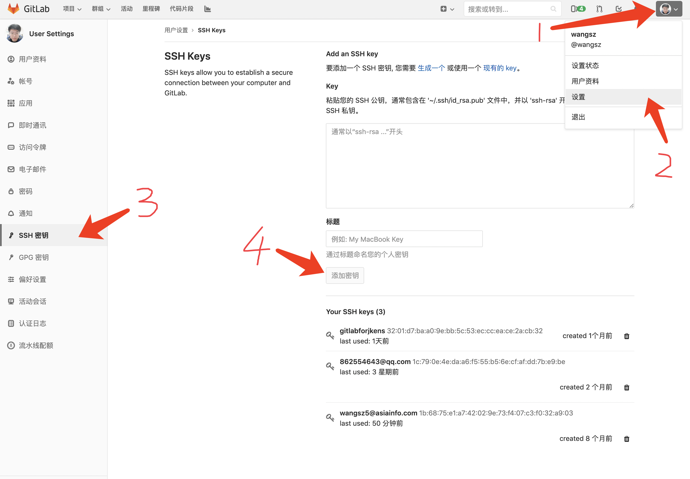

### 基础使用命令

```sequence
participant 远程仓库 as remote
participant 本地仓库 as repository
participant 缓存区 as index
participant 工作区 as workspace

remote->workspace: git pull origin
remote->repository: git fetch/clone [url]
repository->workspace: git checkout [branch name]
workspace->index: git add [文件路径/正则]
index->repository: git commit -m "msg"
repository->remote: git push origin
```

以下操作均为本地操作

```bash
# 查看分支
git branch

# 新建分支
git checkouut -b [newBranchName]

```


### 便捷操作命令

```sequence
 participant 远程仓库 as remote
 participant 本地仓库 as repository
 participant 缓存区 as index
 participant 工作区 as workspace

remote-->workspace: 同步仓库分支变更：git pull -p 
remote-->repository: 获取远程仓库新增变更：git fetch origin
workspace-->index: 添加所有变更文件：git add .
workspace-->repository: 对已添加仓库文件直接提交：git commit -am "msg"

```

## 分支策略

| 分支名       | 描述             | 功能                                                   |
| ------------ | ---------------- | ------------------------------------------------------ |
| master       | 主分支           | 往生产环境发布的预备代码，打过标记的代码才可以正式发布 |
| develop      | 开发分支         | 测试环境代码，可以随时发                               |
| gray         | 生产环境灰度代码 |                                                        |
| experimental | 实验性环境       | 测试环境灰度，实验新功能等~                            |
| ^bug-        | 线上bug修复分支  | 直接从master切出合并                                   |
| 其他分支     | 功能开发分支     | 如无意外均从develop分支上拉取代码                      |

四个主要分支 `master` `develop` `gray` `experimental` 均设置为受保护分支、不允许任何人 `push` 代码，`developer` 及以上权限人员可以提合并请求，`master` 的操作合并权限仅开放给 主程序员 。

## 发布策略

目前通过`jekins`发布

发布线上代码：配合`Git Parameter Plug-In`插件，按照`tag`标记来完成

线上灰度、测试、实验性环境代码：直接通过拉取相应分支发布

## gitlab常用操作

### 基础信息

| 项   | 内容                                                    | 备注 |
| ---- | ------------------------------------------------------- | ---- |
| 地址 | [http://10.124.210.4:17530](http://10.124.210.4:17530/) |      |
|      |                                                         |      |

### 完成功能开发

```sequence
 participant 议题 as ius
 	participant 合并请求 as merge
	 participant 新功能分支 as new
 participant develop as dev
 participant master as m

ius->ius: 新建议题
ius->new: 创建新功能分支(从dev新建)
new->new: 开发完成提交代码
new->merge: 提合并请求
merge->merge: 代码评审
merge->dev: 审核通过后合并至dev
dev->dev: 可发布测试环境测试
dev->ius: 关闭议题
dev->merge: 准备发布上线提合并请求
merge->merge: 根据情况查看是否要评审
merge->m: 合并
m->m: 创建tag
```

选择你要使用的项目

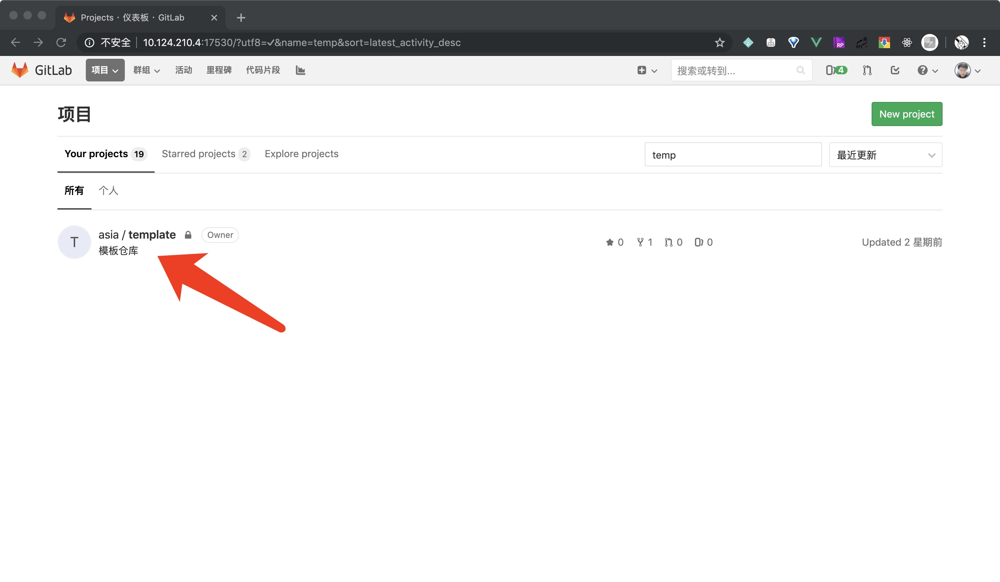

点击议题

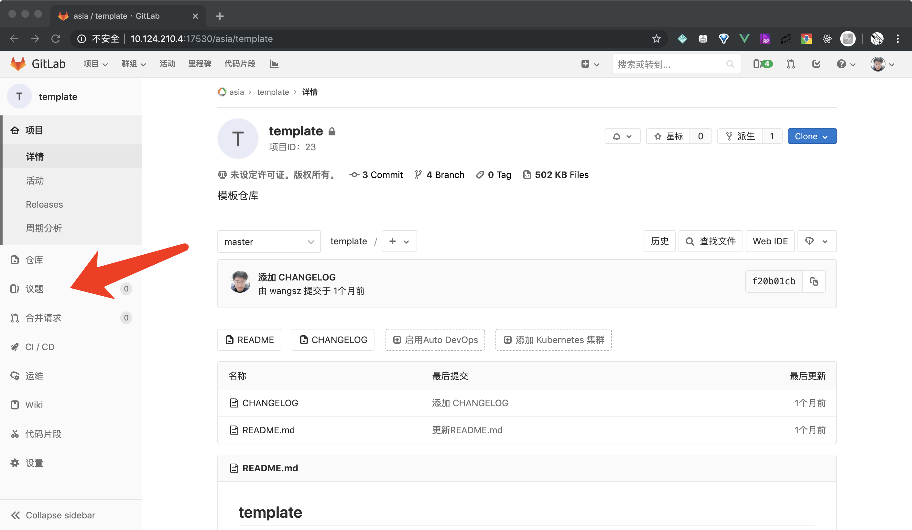

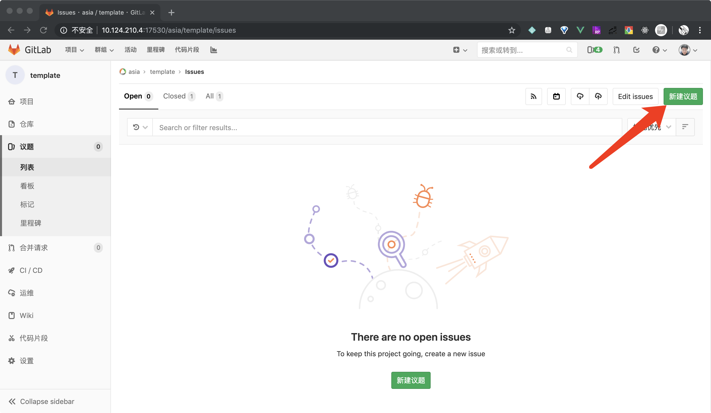

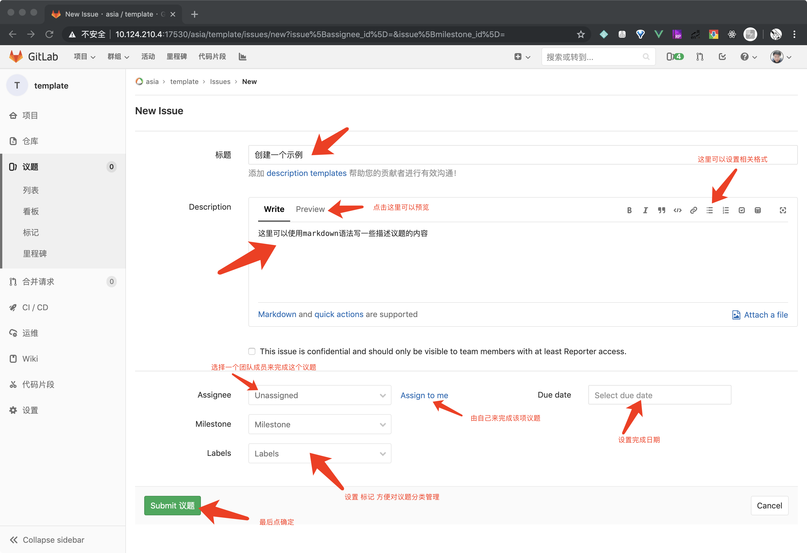

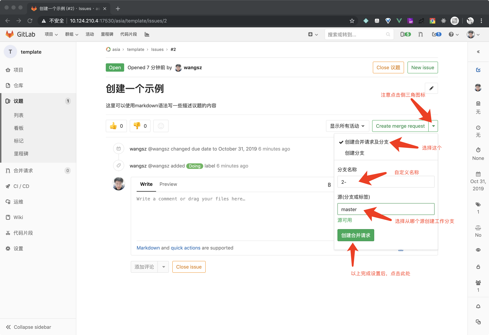

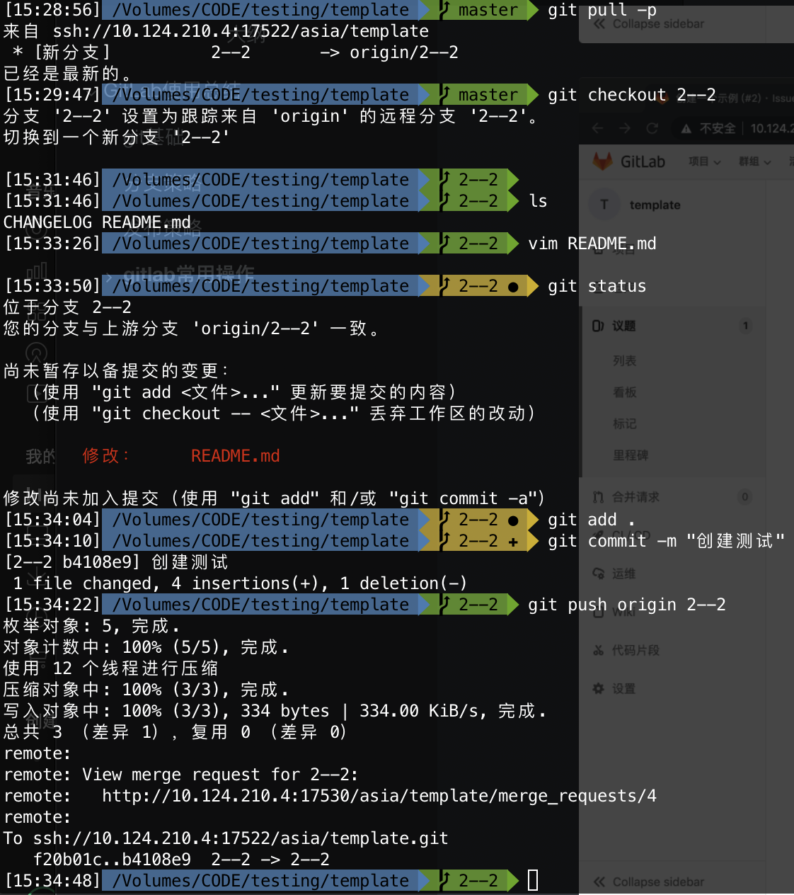

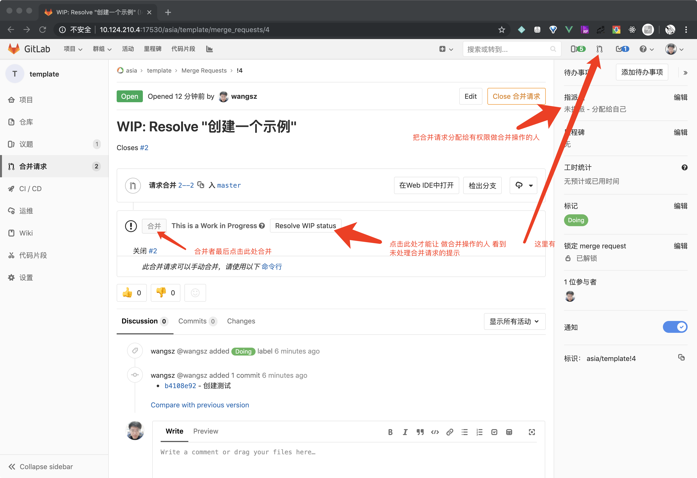

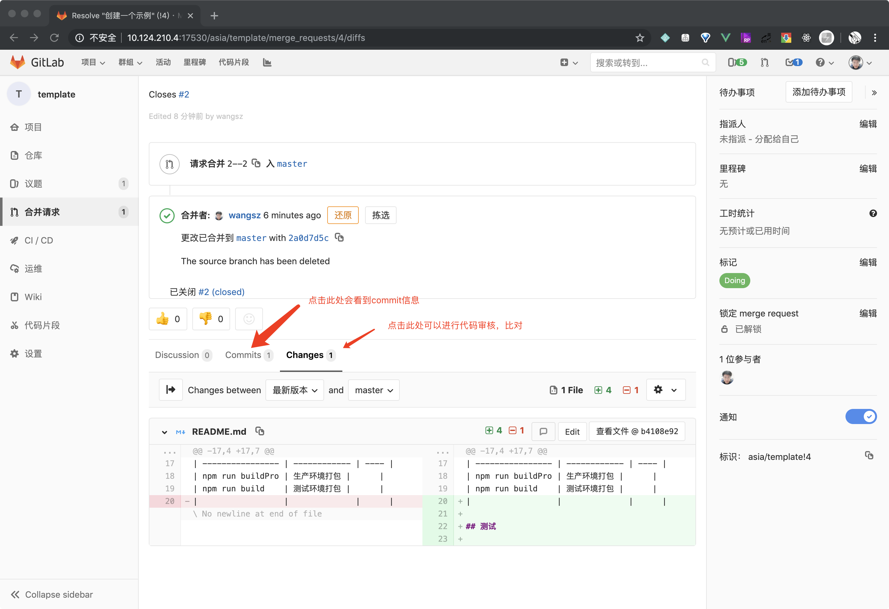


### 打标记发布版本

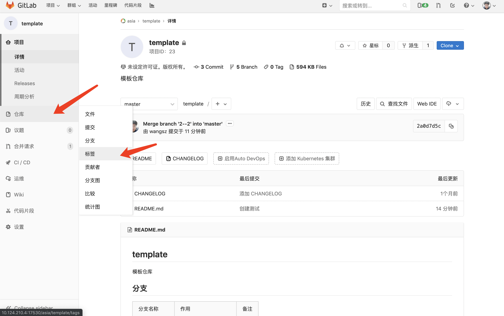

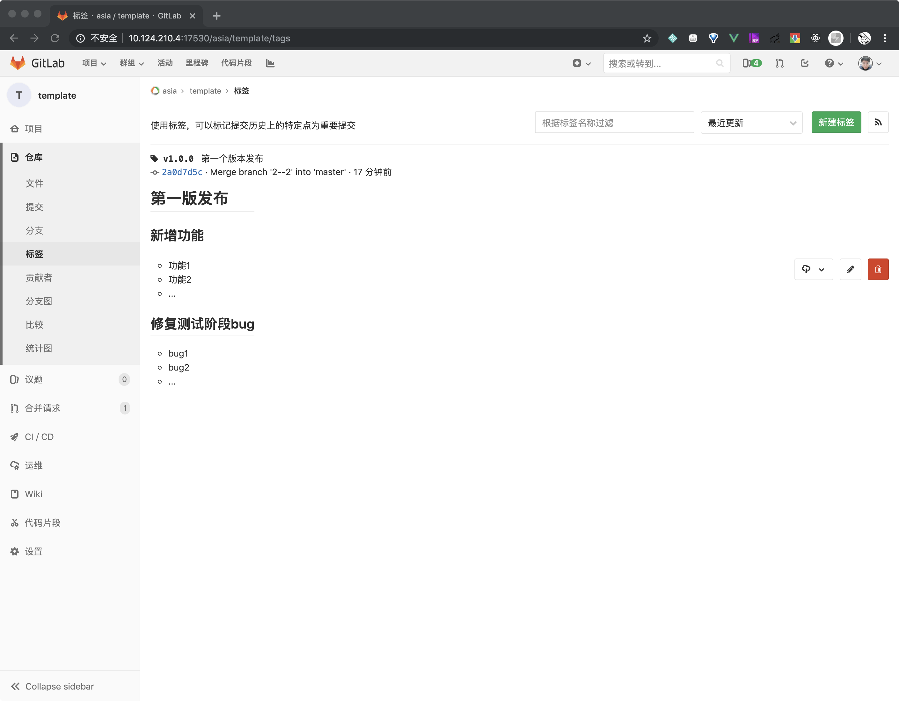