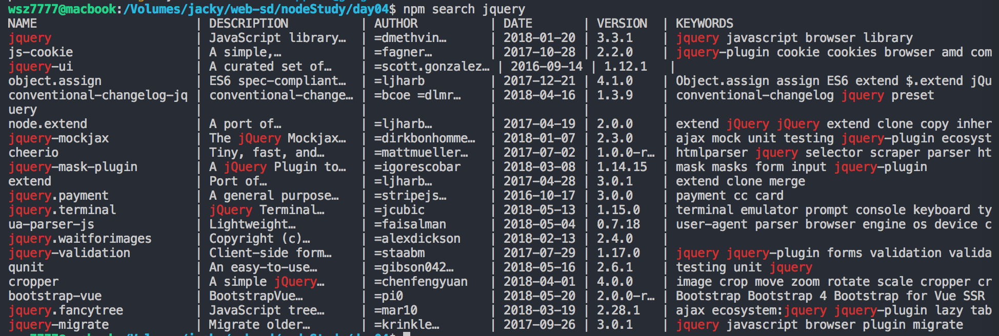
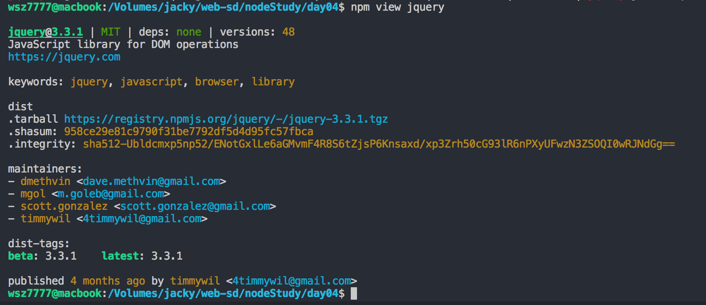

[TOC]

# 查看NPM仓库

​	今天学习了两个命令，是用来查看NPM包的信息以及在NPM仓库中模糊搜索的。

## 在NPM仓库中搜索

```bash
$ npm search <package-name>
```



​	这样直接可以搜索到你想要找的包。注意！！！使用这个命令的时候必须使用NPM官方镜像，不会用更换镜像源的请移步[nrm的安装与使用](./nrm安装与使用.md)。如果不想每次都换源玩，有两种方法：第一，翻墙~这个自行探索；第二，在每次搜索的时候在命令最后添加 `--registry=https://registry.npmjs.org/` ，当然个人觉得这种方法好，但是。。。很麻烦昂。

## 在NPM仓库中查看包的详细信息

```bash
$ npm view <package-name>
```



​	详细信息如图所示。