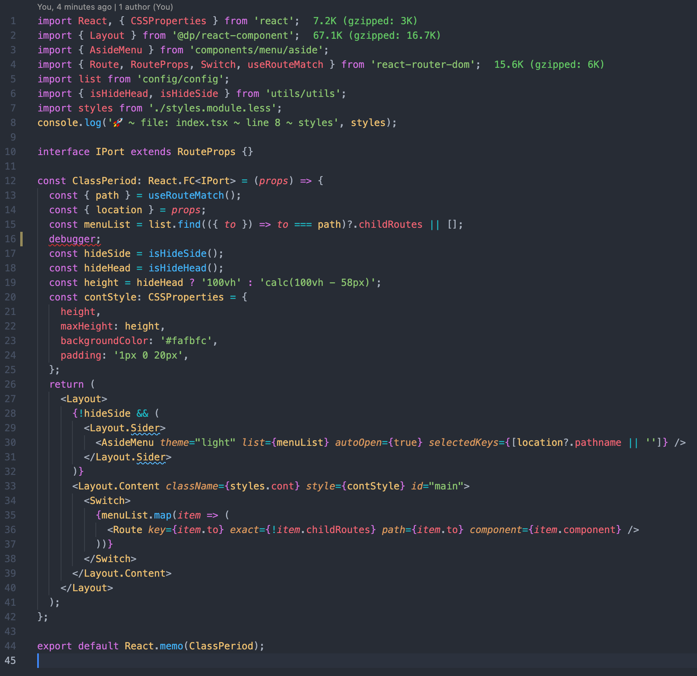
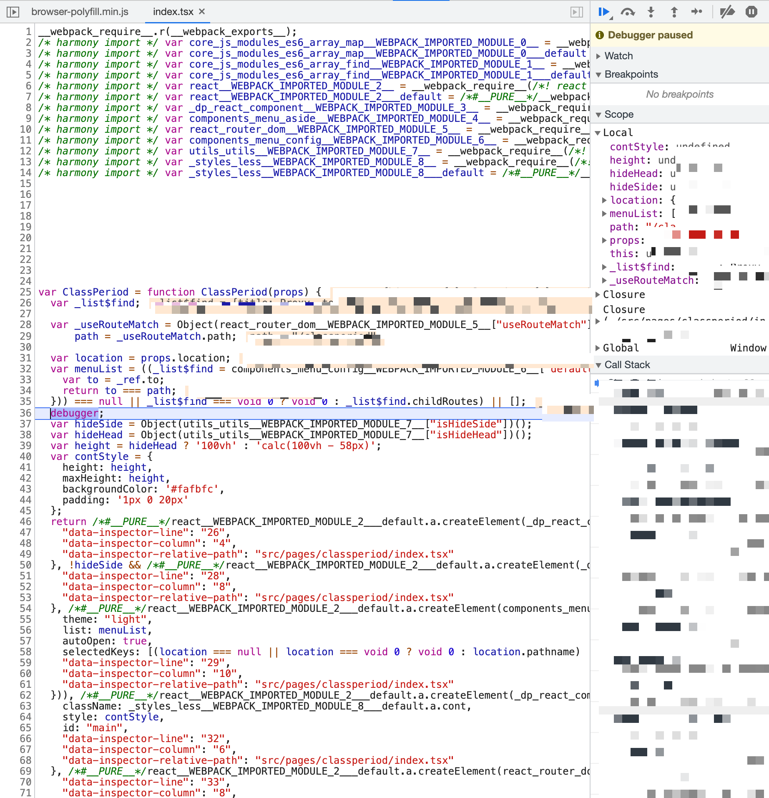
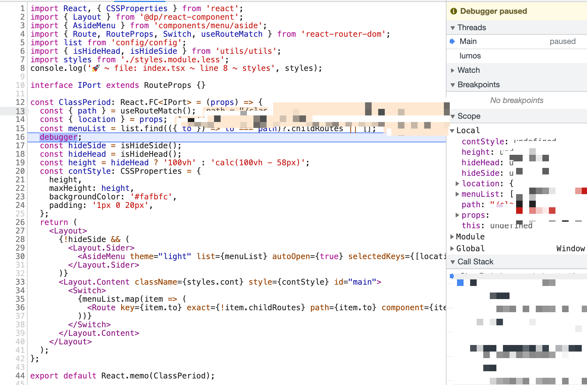
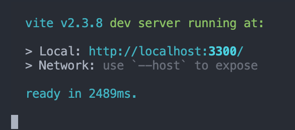
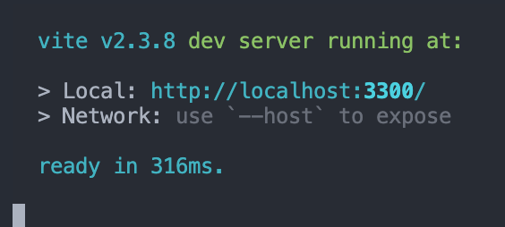

[toc]

# vite打包实践

## 问题

1. webpack开启开发环境的打包速度慢，一个普通项目通常需要20s，对于维护半年以上并且增加功能的项目来说40s起步，上不封顶。vite通常只需要2000ms（2s），二次启动20ms。

2. 同时拖慢的还有开发时重编译=>页面刷新=>可调试的体验。根据同事使用webpack改造esbuild的数据实测，重编译时间由 3s~5s 缩短为 1s。单从数据看3、5s于1s变化不大，但是对于开发者来讲这个体验从：保存代码=>切换到浏览器=>等待3s白屏=>等待页面加载=>开始调试 的流程升级为 保存=>切换到浏览器=>开始调试

3. 源代码调试

   这是代码：
   
   
   这是用wepack打包，在浏览器中的代码调试：
   
   
   
   这是迁移vite后浏览器中调试的代码：
   
   这其中的问题就不必我多言了吧~

## 迁移vite所需要支持的能力

- [x] 1. 设定打包后输出的路径并支持自定义url为CDN
- [x] 2. Css module
- [x] 3. alias解析
- [x] 4. dev server
- [x] 5. 保存代码后自动刷新浏览器页面
- [x] 6. svg加载为组件而不是转换为base64
- [x] 7. 打包后支持旧浏览器的访问 IE11
- [x] 8. ssi
- [x] 9. 区分本地调试和各种环境——环境变量问题
- [x] 10. [react-dev-inspector](https://github.com/zthxxx/react-dev-inspector)的功能 

## 实现

### 1. 设定打包后输出的路径并支持自定义url为CDN

无需多言，看配置

设定打包后输出的路径： https://cn.vitejs.dev/config/#build-outdir

自定义静态资源路径为CDN链接：https://cn.vitejs.dev/config/#base

```typescript
import { defineConfig } from 'vite';

export default defineConfig({
    // 自定义静态资源路径为CDN链接：https://cn.vitejs.dev/config/#base
    base: isProd ? 'https://xxx.cdn.com/xxx/xxx/' :'/',
    // 设定打包后输出的路径：https://cn.vitejs.dev/config/#build-outdir
    build: {
      outDir: path.join(process.cwd(), ENV.VITE_OUT_DIR),
    }
})
```

### 2. Css module

Vite 只支持 ```xxx.module.less``` 、```xxx.module.css```、```xxx.module.scss``` 这种格式的文件，看了下实现是采用```postcss``` + 插件来实现 css module 的能力的，有兴趣的同学可以看下 [postcss-modules](https://github.com/madyankin/postcss-modules)

所以这里送上```MacOS```递归修改 ```.less``` => ```.module.less``` 的脚本~

```bash
find ./ -name "*.less" | awk -F "." '{print $2}' | xargs -I {} -t  mv ./{}.less  ./{}.module.less
```

没有 ```xargs``` 的小伙伴 ```brew install xargs``` 即可~ 

liunx版本：

```bash
find ./ -name "*.less" | awk -F "." '{print $2}' | xargs -i {} -t  mv ./{}.less  ./{}.module.less
```

Windows：你们应该有`git bash`吧~，或者哪位小伙伴贡献一下代码，或者等我用nodejs写个通用的脚本。。。

### 3. alias解析

[官网配置传送门](https://cn.vitejs.dev/config/#resolve-alias)

```ts
import { defineConfig } from 'vite';

export default defineConfig({
  // https://cn.vitejs.dev/config/#resolve-alias
  resolve: {
    alias: [
      { find: /^components/, replacement: '/src/components' },
      { find: /^apis/, replacement: '/src/apis' },
      { find: /^assets/, replacement: '/src/assets' },
      { find: /^config/, replacement: '/src/config' },
      { find: /^pages/, replacement: '/src/pages' },
      { find: /^images/, replacement: '/src/images' },
      { find: /^utils/, replacement: '/src/utils' },
      { find: /^store/, replacement: '/src/store' },
      { find: /^types/, replacement: '/src/types' },
      { find: /^src/, replacement: '/src' },
    ],
  },
})
```

### 4. dev server

[官网配置传送门](https://cn.vitejs.dev/config/#server-options)

还是原来的配方~还是原来的味道，和webpack配置基本相同~

### 5. 保存代码后自动刷新浏览器页面

官方已提供插件~

```ts
import { defineConfig } from 'vite';
import reactRefresh from '@vitejs/plugin-react-refresh';

export default defineConfig({
  plugins: [reactRefresh()]
})
```

### 6. svg加载为组件而不是转换为base64

刚开始找到 [vite-plugin-svgr](https://github.com/pd4d10/vite-plugin-svgr) 但是

```ts
import { ReactComponent as Logo } from './logo.svg'
```

这种写法实在不能接受而且改动量很烦躁。。。

还是被我找到 [vite-plugin-react-svg](https://www.npmjs.com/package/vite-plugin-react-svg) ~原来的写法得以不修改了，配置如下

```ts
import { defineConfig } from 'vite';
import reactSvgPlugin from 'vite-plugin-react-svg';

export default defineConfig({
  plugins: [reactSvgPlugin({ defaultExport: 'component' })]
})

```

### 7. 打包后支持旧浏览器的访问 IE11

官方插件支持~

https://cn.vitejs.dev/config/#build-polyfilldynamicimport

https://github.com/vitejs/vite/tree/main/packages/plugin-legacy

### 8. ssi

 [vite-plugin-ssi](https://www.npmjs.com/package/vite-plugin-ssi) 

```typescript
import { defineConfig } from 'vite';
import ssi from 'vite-plugin-ssi';

export default defineConfig({
  plugins: [
    ssi({
      remoteBasePath: 'http://xxx.xxx.com/xxx',
      apply: 'serve' // or 'build' 在开发还是生产模式下运行。不设定的话默认执行
    })
  ]
})
```

没使用之前我写了一个nodejs脚本来生成 index.html，有兴趣的同学可以看下，没事儿可以跳过了~

目录结构是：

```bash
# 目录结构
.
├── index.html  // 入口文件 & 脚本通过模板fix得来的
├── scripts
│   └── createBuildHtml.js  // 脚本
└── template
		└── index.html // 模板文件
# 启动命令
$ node scripts/createBuildHtml.js
```


```js
// scripts/createBuildHtml.js
const fs = require('fs');
const path = require('path');

const rootPath = process.cwd();

let templateHtml = fs.readFileSync(path.join(rootPath, 'template', 'index.html'), 'utf-8');
const axios = require('axios');

console.log('---------------------\n', /<!--#.*-->/.test(templateHtml));
const matchList = templateHtml.match(/<!--#.*-->/g);
console.log('---------------------\n', matchList);

Promise.all(matchList.map(async (value, i, arr) => {
  const [mark, ...attrsStr] = value.replace(/(<!--#)|(-->)/g, '').trim().split(/\s/);
  const attrs = attrsStr.map(v => v.split('=')).reduce((rst, [key, val]) => {
    rst[key] = val.replace(/(^")|("$)/g, '');
    return rst;
  }, {});
  console.log(mark, attrs);
  if (mark === 'include') {
    const { data: fileContent } = await axios.get(`http://xxx.com/xxx${attrs?.file}`);
    templateHtml = templateHtml.replace(value, fileContent);
  }
})).then((arr) => {
  console.log('done\n',
    // templateHtml
  );
  fs.writeFileSync(path.join(rootPath, 'index.html'), templateHtml);
});

```

### 9. 区分本地调试和各种环境——环境变量问题

我们现有环境有

- 本地开发的无限个联调环境
- maat部署环境（测试+联调环境）
- 线上部署环境（线上和灰度）

为了减少项目中会有非常多的地方写

```ts
const xx = isProd ? 'xxx1' : 'xxx2'
```

的情况，我们改为直接使用环境变量来解决，以上代码会变为

```ts
// .env.production 文件
VITE_XX='xxx1'

// .env.development 文件
VITE_XX='xxx2'

// use file
const xx = import.mate.env.VITE_XX
```

并且本地调试时经常变动的项可以写在 ```.env.[mode].local``` 文件中，并在 `.gitignore` 中添加 `*.local`  来忽略该文件提交，例如本地修改联调环境这个场景就可以写成：

```ts
   const fev = ENV.VITE_HOST_NAME_FOR_SERVER;
   //...
   server: {
      port: 3300,
      proxy: {
        '^/lumos/api/': {
          target: `http://${fev}.fedev.bytedance.net`,
          changeOrigin: true,
          headers: {
            host: new URL(`http://${fev}.fedev.bytedance.net`).host,
          },
        },
      },
    },
   // ...其他配置
```

当前工作目录为：

```bash
# 目录结构
env
├── .env
├── .env.development
├── .env.development.local
├── .env.maat
└── .env.production
```

`.env.development.local` 中任意修改  `VITE_HOST_NAME_FOR_SERVER=npy-dev` 该属性的值，多人协作时不必在意其他人的提交影响到自己，不用考虑反复修改配置，不用记住那么多的联调环境域名。

在迁移和使用的过程中遇到了一些问题，特此提醒：

1. 不要在 `.env` 中修改 `NODE_ENV` 会出现一些意想不到的情况

2. ```ts
   // vite.config.ts 中取不能直接使用 import.mate.env.VITE_XXX 需要使用 loadEnv 来使用
   import { defineConfig, loadEnv } from 'vite';
   
   export default ({ mode }) => {
     const envPath = path.join(process.cwd(), 'env');
     const ENV = loadEnv(mode, envPath);
     const fev = ENV.VITE_HOST_NAME_FOR_SERVER;
     console.log('loadEnv', ENV, mode);
   
     return defineConfig({
       // 其他配置   
     });
   })
   
   ```

3. 环境变量需要以 `VITE_` 开头，不然 `vite.config.ts` 中会取不到

### 10. [react-dev-inspector](https://github.com/zthxxx/react-dev-inspector)的功能 

排查功能失效问题（在 `.env` 中设置了 `NODE_ENV=production` 导致）

```ts
import { defineConfig } from 'vite';
import { inspectorServer } from 'react-dev-inspector/plugins/vite';

export default defineConfig({
  plugins: [
    inspectorServer(),
  ]
})
```

## 改造结果

首次启动



二次启动



修改文件 注释或是添加debugger无重新编译，直接加载~

